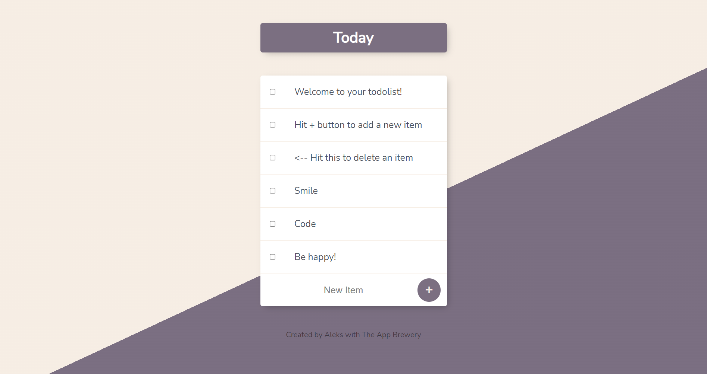

# To Do List

- A project created in Node.js with Express, EJS and connected with Mongoose. User can create a multiple To Do lists by addings its name to the site url (e.g. '/work' or '/Shopping', etc.)

- This project forms a part of the Complete 2022 Web Development Bootcamp with [The App Brewery](https://www.appbrewery.co/).

